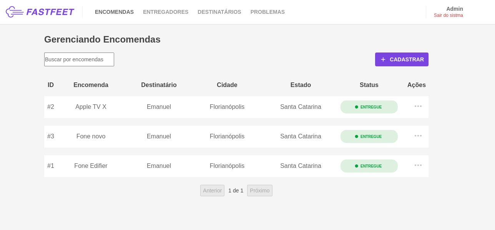
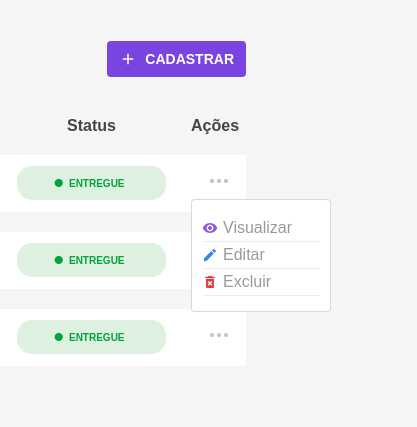
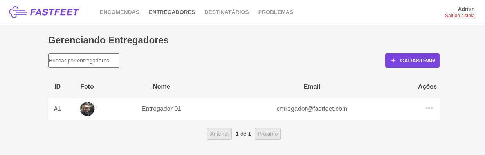
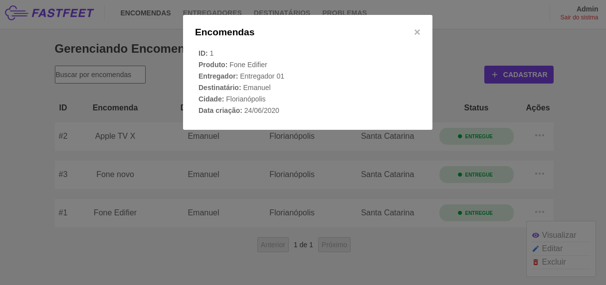
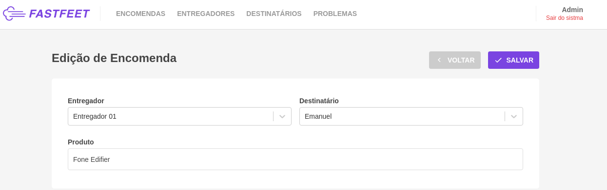
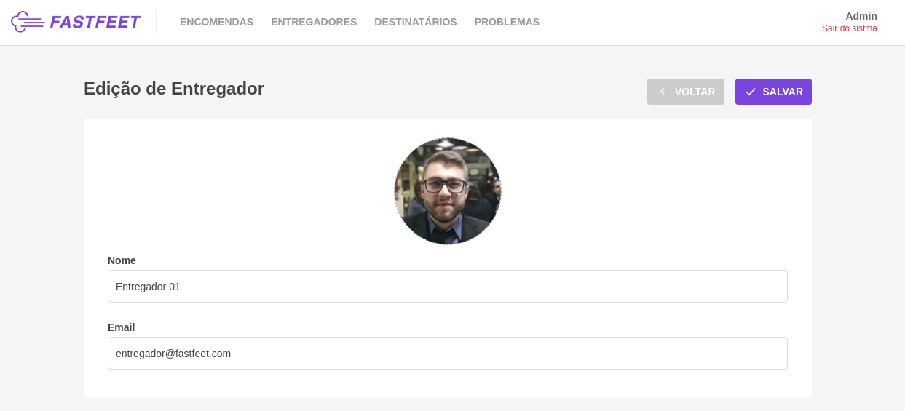
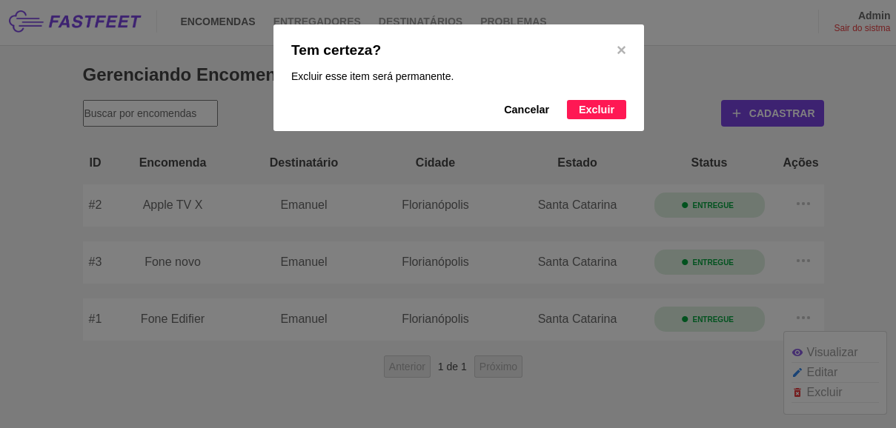

## FastFeet Web

Para subir o front e o back-end, rode: `docker-compose up`.

Abra em seu navegador: `localhost:3000`
email: `admin@fastfeet.com`
senha: `123456`

Se preferir subir manualmente, siga o [tutorial da wiki](https://github.com/emanuelhfarias/FastFeet/wiki/Instala%C3%A7%C3%A3o).

## :camera: Screenshots

<h1 align="center">
  
  
  
  
  
  
  
</h1>
